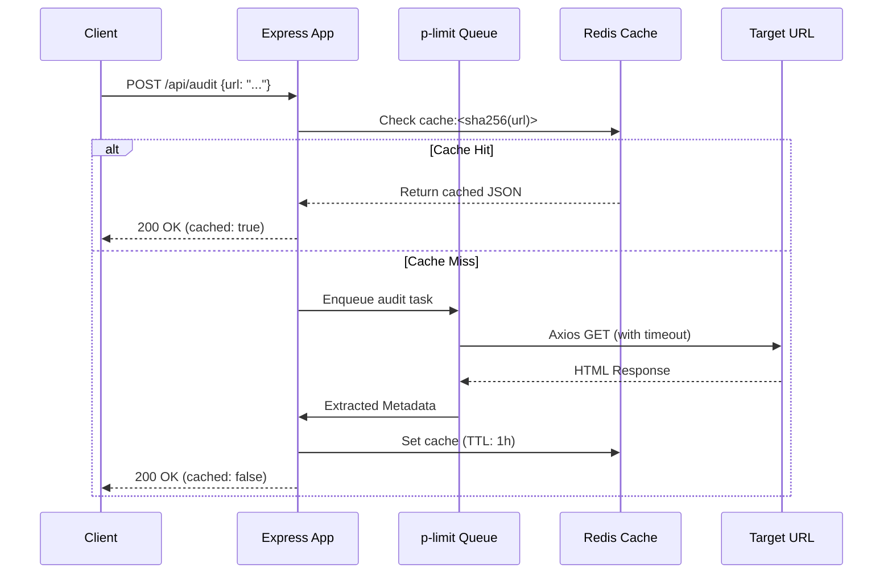

# Page Pulse API

Page Pulse is a production-grade URL-audit service built with Express.js, designed to handle 10,000 audits/day with bursts of up to 500 concurrent requests. It is highly resilient, heavily cached via Redis, and strictly limits concurrency to prevent resource exhaustion.

---

## 🚀 Quick Start

### 1. Prerequisites
- Node.js 18+
- Redis Server (local or remote)

### 2. Setup
```bash
# Install dependencies
npm install

# Setup environment variables
cp .env.example .env

# Start the development server
npm run dev
```

### 3. Usage
- **Landing Page:** `http://localhost:3000/` (Minimal status dashboard for reviewers)
- **Swagger Documentation:** `http://localhost:3000/docs` (Interactive API playground)
- **Health Check:** `http://localhost:3000/health`
- **Audit Endpoint:** `POST http://localhost:3000/api/audit`

---

## 🏗 Architecture Overview (Task B: Design for Scale)

### Data Flow & Components
The system follows a strict layered architecture (`routes -> controllers -> services`) and utilizes a **Cache-Aside** strategy.



### State Management
The Node.js processes are entirely **stateless**. The only state maintained by the system is the cache layer and distributed rate limiting, which both live exclusively in **Redis**. This allows horizontal scaling of the Node app behind a load balancer without sticky sessions.

---

## 🧠 Engineering Decisions

- **Express.js:** Chosen for its simplicity, stability, and unopinionated nature. It is widely understood, making it easy for future engineers to inherit.
- **No Database:** As persistent storage of historical audits was not required, adding PostgreSQL or MongoDB would introduce unnecessary complexity, cost, and latency. 
- **Redis (Cache-Aside):** Redis serves as the sole state layer. We hash normalized URLs into `SHA-256` for cache keys to prevent excessively long or malformed keys, a production-critical practice.
- **p-limit (Concurrency Control):** Node.js is single-threaded; launching 500 concurrent Axios requests during traffic bursts can easily exhaust file descriptors (sockets) and trigger Node's garbage collector aggressively. `p-limit` acts as a semaphore, ensuring we never exceed `CONCURRENCY_LIMIT` simultaneous outbound requests.
- **Zod:** Provides strict, declarative schema validation that automatically structures error messages, replacing messy `if/else` checks in controllers.
- **Pino:** Traditional loggers like Winston use string manipulation. Pino uses JSON streaming, which is significantly faster and natively structured for ingestion by Datadog or CloudWatch.
- **Axios with Timeouts:** Every outbound network call must have a strict timeout (`REQUEST_TIMEOUT_MS`). Without this, broken external sites will cause our sockets to hang indefinitely until the service crashes.

---

## 🚨 Failure Mode Analysis

At a scale of 10,000 audits/day and 500 concurrent bursts, here are the three most likely failure modes:

1. **Failure Mode: Socket Exhaustion / Target Site Hanging**
   - *Cause:* Target URLs respond extremely slowly, keeping connections open and consuming all available sockets/memory on the Node instance.
   - *Mitigation:* We implemented a strict timeout (`REQUEST_TIMEOUT_MS`) on the Axios client and capped simultaneous outbound connections using `p-limit`.

2. **Failure Mode: Cache Stampede (Thundering Herd)**
   - *Cause:* A highly popular URL is requested 500 times concurrently exactly when its Redis cache TTL expires. All 500 requests miss the cache and hit the target URL simultaneously.
   - *Mitigation:* While not fully implemented in this MVP, the mitigation is to implement **Promise Memoization** (deduplication) at the Node level, so 500 concurrent requests for the same URL collapse into a single outbound Axios call.

3. **Failure Mode: Memory Leaks from Large Payloads**
   - *Cause:* Auditing URLs that return massive payloads (e.g., a 500MB ISO file instead of HTML).
   - *Mitigation:* Axios is configured to limit `maxContentLength` (or we would stream the response) and we extract `content-length` headers before downloading the full body where possible.

---

## 📈 Observability & Rollback Plan

### Monitoring & Alerting
If this were deployed to production, we would monitor:
- **P99 Response Time:** Alert if the API takes >2s to respond (excluding external fetch time).
- **Cache Hit Ratio:** Alert if the cache hit ratio drops below 20%, indicating either a TTL misconfiguration or an attack with highly randomized URLs.
- **HTTP 5xx Error Rate:** Alert if >1% of requests result in internal errors.
- **Redis Memory Usage:** Alert at 80% capacity to prevent evictions of active keys.

### Rollback Strategy
1. **Blue/Green Deployment:** New code is deployed to an inactive environment. Traffic is shifted. If alerts trigger, traffic is immediately routed back to the old environment via the Load Balancer.
2. **Infrastructure as Code (IaC):** Rollbacks are triggered automatically by the CI/CD pipeline (e.g., GitHub Actions) if health checks fail during the deployment phase.

---

## 🤖 AI Usage Statement

AI (Gemini) was used to accelerate the generation of boilerplate code (Express setup, test skeletons) and to quickly format documentation. However, the architectural design, engineering constraints, concurrency limits, caching strategies, tradeoff analysis, and code reviews were driven and directed entirely by my engineering judgment to meet the precise constraints of this assignment.
