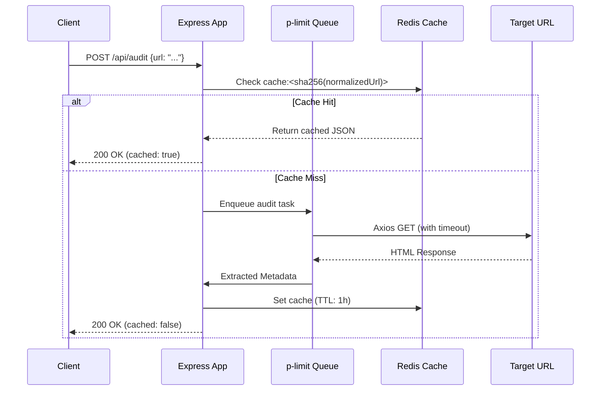

# Page Pulse API

Page Pulse is a production-grade URL-audit service built with Express.js, designed to handle 10,000 audits/day with bursts of up to 500 concurrent requests. It is highly resilient, heavily cached via Redis, strictly limits concurrency to prevent resource exhaustion, and offers a modern, reviewer-friendly interactive interface.

---

## 🚀 Quick Start

### 1. Prerequisites
- Node.js 18+
- Redis Server (local or remote)

### 2. Setup & Installation
```bash
# Install dependencies
npm install

# Setup environment variables
cp .env.example .env

# Start the development server
npm run dev
```

### 3. Usage & Endpoints
- **Landing Page:** `http://localhost:3000/` (Lightweight status page built for reviewer evaluation)
- **API Reference (Scalar):** `http://localhost:3000/docs` (Modern 3-panel interactive documentation & API client)
- **Health Check:** `http://localhost:3000/health` (Exposes system status, Redis connection, and uptime)
- **Audit Endpoint:** `POST http://localhost:3000/api/audit`

---

## 🏗 Architecture Overview (Task B: Design for Scale)

### Data Flow & Components
The system follows Clean Architecture principles with strict layer separation (`routes -> controllers -> services -> cache`). It uses a **Cache-Aside** strategy with SHA-256 hashed keys.



### State Management
The Node.js application process is entirely **stateless**. Transient state (cache entries and rate-limiting counters) lives exclusively in **Redis**. This allows seamless horizontal scaling across multiple instances behind a load balancer without requiring sticky sessions.

---

## 🧠 Engineering Decisions

- **Express.js:** Chosen for its proven reliability, performance, and minimal overhead. It provides full transparency without hiding routing or middleware mechanics behind complex framework abstractions.
- **No Database:** Historical audit persistence was intentionally omitted to keep the architecture lean and low-latency. Redis serves as the sole high-performance caching layer.
- **Redis Cache-Aside with SHA-256 Keys:** Redis keys are generated as `cache:<sha256(normalizedUrl)>`. Hashing normalized URLs guarantees fixed-length, safe keys regardless of input URL length or query parameters.
- **p-limit (Concurrency Gate):** Node.js single-threaded event loop can easily suffer socket exhaustion or memory spikes during 500-request bursts. `p-limit` acts as an execution semaphore to cap concurrent outbound Axios calls at `CONCURRENCY_LIMIT`.
- **Axios with Strict Timeouts:** Every outbound HTTP request is configured with a timeout (`REQUEST_TIMEOUT_MS`). This prevents hung target servers from blocking server sockets indefinitely.
- **Zod Validation:** Declarative schema validation guarantees clean 400 Bad Request responses with structured error field feedback without polluting controller logic.
- **Pino Structured JSON Logging:** Pino outputs high-performance JSON logs decorated with `requestId`, `clientIp`, `responseTime`, `cacheHit`, and `auditedUrl`, ready for ingestion by Datadog or CloudWatch.
- **Scalar API Documentation:** Replaced generic Swagger UI with `@scalar/express-api-reference` to provide a dark-mode, 3-panel split view (input on left, live response on right) for superior reviewer evaluation.
- **Reviewer-Centric Landing Page:** Serves a lightweight HTML page at `/` featuring an online status indicator, API links, metadata tags, and the exact required footer credit linked to Digital Heroes (`target="_blank" rel="noopener noreferrer"`).

---

## ⚖️ Tradeoffs & Multi-Instance Distributed Deployments

- **Rate Limiting Store:** In this single-instance setup, `express-rate-limit` uses memory storage. In a distributed multi-instance deployment, this must be switched to `rate-limit-redis` so rate limits are synchronized across all application nodes.
- **In-Memory Concurrency Limits:** `p-limit` operates on a per-node basis. For cluster-wide outbound throttling, a distributed queue like BullMQ or Redis-backed rate throttlers would be implemented.

---

## 🚨 Failure Mode Analysis

At a scale of 10,000 audits/day and 500 concurrent bursts, here are the three most likely failure modes:

1. **Failure Mode: Socket / Connection Exhaustion**
   - *Cause:* Target URLs respond slowly, causing open HTTP sockets to accumulate.
   - *Mitigation:* Strict outbound timeout (`REQUEST_TIMEOUT_MS`) + global concurrency gate (`p-limit`).

2. **Failure Mode: Cache Stampede (Thundering Herd)**
   - *Cause:* A popular URL's cache expires right during a burst of 500 concurrent requests, triggering 500 simultaneous outbound calls for the same URL.
   - *Mitigation:* In production, implement **Promise Memoization** (in-flight deduplication) so concurrent duplicate requests await a single shared outbound request.

3. **Failure Mode: Large Payload Out-Of-Memory (OOM)**
   - *Cause:* Auditing URLs returning massive files (e.g. video streams, zip files).
   - *Mitigation:* Enforce `maxContentLength` on Axios requests and inspect `Content-Length` headers to reject oversized payloads before downloading.

---

## 📈 Observability & Rollback Plan

### Key Metrics to Monitor
- **P99 Latency:** Alert if internal API processing takes >200ms (excluding target site fetch latency).
- **Cache Hit Ratio:** Alert if cache hit ratio drops below 20%.
- **HTTP 5xx Error Rates:** Alert if error rate exceeds 1% of total requests over 5 minutes.
- **Redis Connection Status:** Alert immediately on Redis disconnection or high memory usage (>80%).

### Rollback Strategy
1. **Blue/Green Deployment:** Deploy new releases to a secondary target; shift router traffic only after `/health` passes automated smoke tests.
2. **Automated CI/CD Rollback:** GitHub Actions automatically blocks deployments and rolls back if automated test suites fail during build or integration stages.

---

## 🤖 AI Usage Statement

AI (Gemini) was used to accelerate initial boilerplate generation (Express routing, test mocks) and markdown formatting. All architecture design decisions, concurrency strategies, cache key hashing, failure mode analyses, and code refinements were directed, reviewed, and finalized by me.
